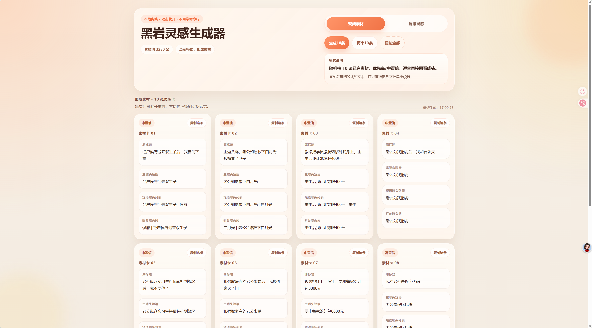
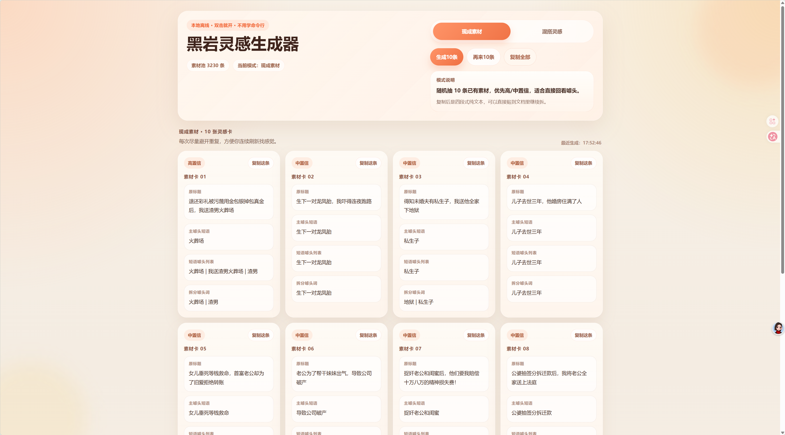

# 黑岩灵感生成器

一个本地离线的黑岩风标题灵感工具，适合从已有噱头素材中快速抽取灵感、拆解主噱头，并按固定套路混搭出新的标题方向。

这是一个更偏实用写作流的本地小应用：

- 不需要联网
- 不需要数据库
- 不需要命令行基础
- 双击即可启动
- 适合个人整理标题素材、找灵感、继续扩写

## GitHub 仓库简介

如果你要填写 GitHub 仓库首页右侧的 `About`，可以直接用这一句：

`本地离线的黑岩风标题灵感生成器，支持随机抽取已有素材和按套路混搭新标题，适合个人学习与非商用使用。`

## 功能

- `现成素材`：随机抽取 10 条已有素材
- `混搭灵感`：基于已有素材重组 10 条新灵感
- `复制这条`
- `复制全部`
- 本地运行，不依赖数据库，不需要联网

## 本地打开方式

进入仓库根目录后，双击：

`双击打开黑岩灵感生成器.bat`

如果浏览器没有自动打开，可以手动访问：

`http://127.0.0.1:3210`

使用时请保持黑色命令行窗口开启，关闭后本地网页服务也会停止。

## 素材文件

默认素材文件位置：

`素材数据/heiyan_hooks_non_empty.xlsx`

## 授权说明

本仓库采用自定义的“仅限个人与非商用使用”授权。

你可以：

- 个人学习
- 本地运行
- 非商用修改
- 在保留署名和授权文件的前提下进行非商用分享

你不可以：

- 商业使用
- 作为付费工具、付费服务、SaaS、课程、代写、工作室流程或客户项目的一部分使用
- 去除 ShiQi Han 的版权与授权声明

完整条款见：

`LICENSE.md`

## Screenshots

## 说明

这个授权不是 OSI 认可的开源许可证，因此严格来说它不是传统意义上的 open source。  
如果你后续想改成“允许商用但保留署名”或“代码开源、数据非商用”的双层授权版本，也可以继续调整。
